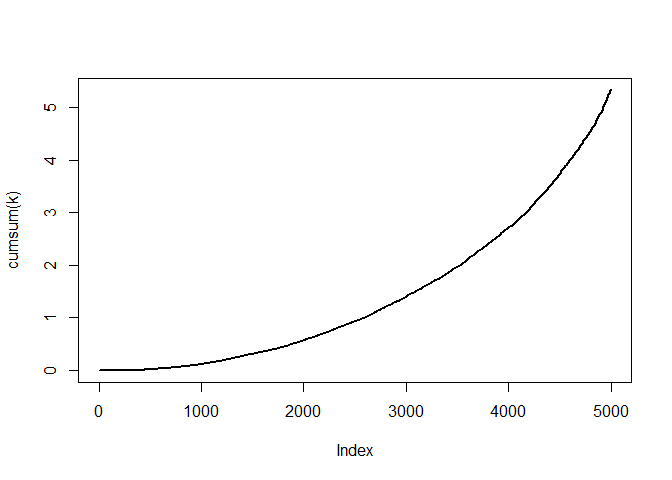

Oblig 3
================
Isak Edvardsen
3 april 2020

``` r
# Simulation from Gamma(alpha,1) distribution using accept-reject 
# and a Gamma(a,b) proposal distribution.

gammasim <- function(n=10000, alfa=3.7) 
{
  a=3
  b=a/alfa
  e = NULL
  x = NULL
  
  for (i in 1:n) {
    
    y = rgamma(1,a,b)
    u = runif(1)
    
    k = b^(-a)*y^(alfa-a)*exp(-(1-b)*y)
      
    if (u < k) x = c(x,y)
  }
  return(x)
}
p = gammasim()
hist(p, freq = FALSE)
curve(dgamma(x,3.7,1), add=TRUE,col='red')
```

<!-- -->

``` r
# Monte carlo integration

mci_int <- function(n) 
{
  n <- 10000 
  u <- rgamma(n, 3.7, 1)
  seq <- 1:(n)
  
  # The function to be integrated:
  
  mci.ex <- function(x) x*log(x)
  
  par(mfrow=c(1,3))
  
  curve(mci.ex(x),xlab="x",ylab="w(x)", from = 0, to = 2)
  
  #plot(function(x) mci.ex(x),xlim=c(0,2),ylim=c(-.7,.7),xlab="x",ylab="w(x)")
  
  # The monte carlo sum:
  
  w_x <- mci.ex(u)
  
  hplot <- cumsum(w_x)/seq
  
  # stdh <- sqrt( cumsum(w_x^2)/seq - (w_x)^2) Nan produced???
  
  par(new=F)
  
  hist(w_x, xlab="Generated Values of w(X) where X~Gamma(3.7, 1)",
       freq=F,col="green",breaks=30,ylab="",main="")
  
  par(new=F)
  
  plot(hplot,type="l",col="blue",xlab="Iteration",
       ylab="Estimate", xlim=c(1,n), ylim=c(1,7))
  
  # par(new=T)
  
  # plot(hplot+stdh/sqrt(seq),type="l",col="green",xlab="",
  #      ylab="",lty=2)
  
  # par(new=T)
  
  # plot(hplot-stdh/sqrt(seq),type="l",col="red",
  #     xlab="",ylab="",lty=2)
  return(1/n*sum(w_x))  
}
k = mci_int(10000)
```

<!-- -->

``` r
cat(k)
```

    ## 5.248631
